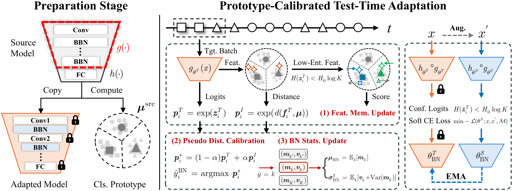
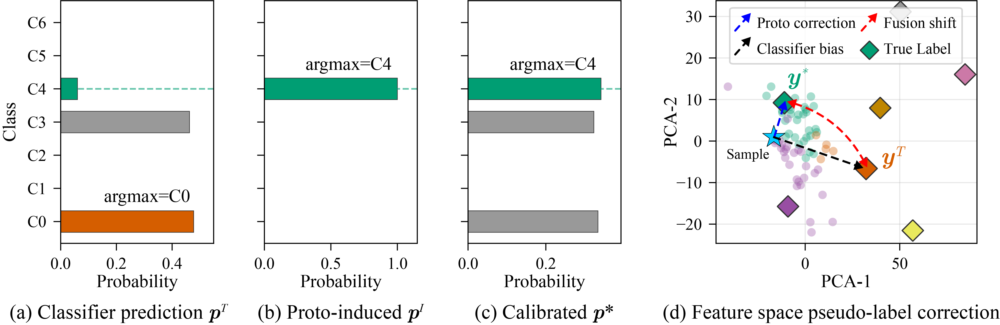
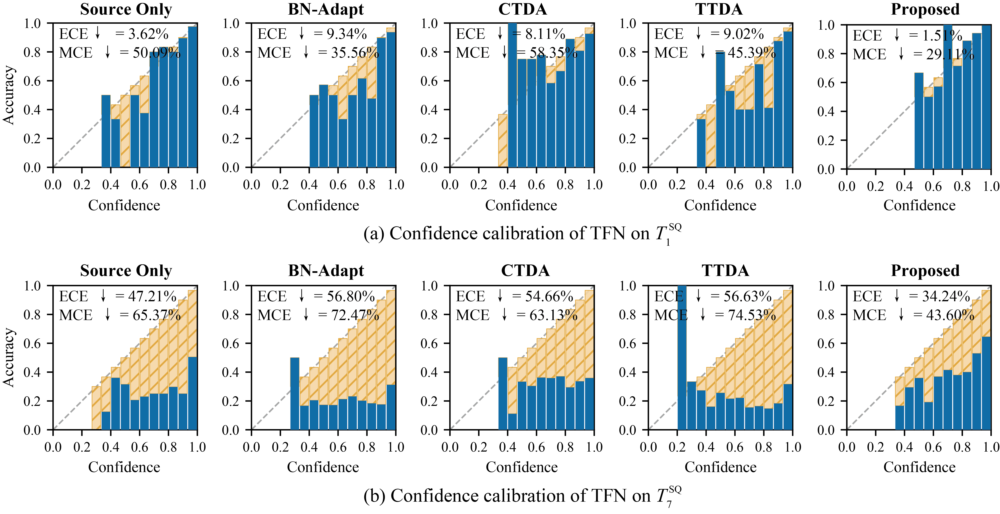
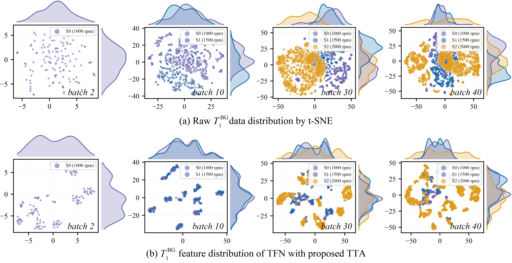
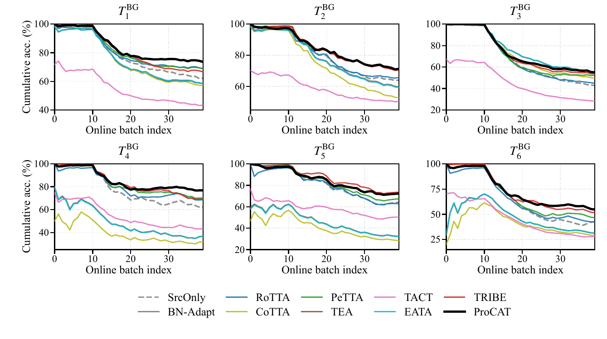
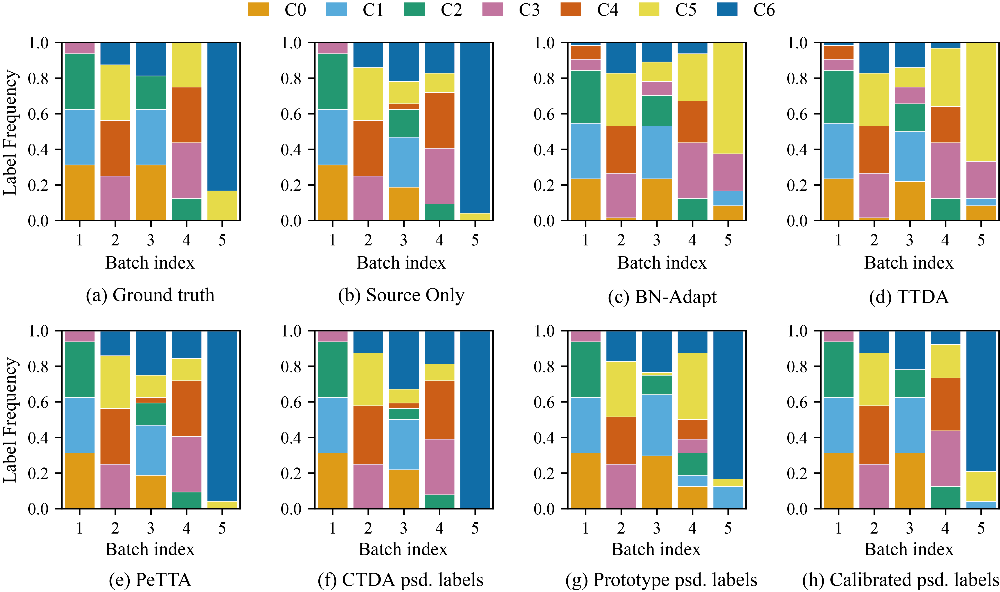

<div align="center">

# ProCAT

### Prototype-Calibrated Test-Time Adaptation for practical online fault diagnosis

**English** | [简体中文](README.zh-CN.md)

[](#-citation)
[](#-method-release-coming-soon)
[](#-quick-start)
[](#-quick-start)
[](#-license)

A reproducible **test-time adaptation (TTA)** benchmark for **1D bearing fault diagnosis**,
with the source code of our proposed method **ProCAT** to be released here.

<sub>🔧 fault diagnosis · 🌊 domain shift · 🎯 feature prototypes · 🧮 class-conditional BN · ⏱️ online learning</sub>

</div>

---

> [!TIP]
> **TL;DR** — Classifier-only pseudo-labels drift under streaming domain shift and class imbalance.
> ProCAT calibrates them with online **feature prototypes**, so both the normalization statistics and
> the self-training signal stay trustworthy. 🎯

---

## 🚧 Method release: coming soon

> The proposed method **ProCAT** (Prototype-Calibrated Test-Time Adaptation) is currently
> being cleaned up and documented for release, and **will be published in this repository soon**.
>
> This repository currently provides the **reproducible benchmark** and **10 baseline methods**
> used in our paper. Please **⭐ Star / 👀 Watch** the repo to be notified when the ProCAT
> source code and pre-trained artifacts go online.

---

## 📝 Abstract

Online fault diagnosis models often suffer from target-domain shifts caused by speed variation,
noise corruption, and local class imbalance. Test-time adaptation (TTA) provides a promising
solution by updating the model online with unlabeled target data. However, current TTA methods
derive pseudo supervision directly from classifier predictions, which may be biased under evolving
target distributions and imbalanced test streams. This can mislead normalization statistics and
amplify erroneous adaptation. This paper proposes **Prototype-CAlibrated Test-time adaptation
(ProCAT)** for online fault diagnosis under streaming domain shifts, which augments a
teacher–student adapter with a feature-prototype calibration mechanism. Specifically,
source-domain prototypes are constructed as initial semantic anchors, while a class-balanced
feature memory progressively refines target-domain prototypes using high-confidence samples. The
prototype-induced posterior is then fused with the teacher prediction into a single calibrated
pseudo-distribution, which simultaneously drives the class-conditional batch-normalization buckets
and provides soft supervision for student self-training adaptation. During deployment, only
normalization affine parameters are gradient-updated, while the teacher is updated by exponential
moving average to provide temporally stable prediction for subsequent target batches. Extensive
experiments on mechanical fault datasets demonstrate that the proposed method achieves
state-of-the-art performance in practical online diagnosis scenarios with domain shift, dynamic
noise, and label imbalance.

---

## ✨ Highlights

- 🧩 A **prototype-calibrated** test-time adaptation method for online fault diagnosis.
- 🧠 Source-initialized **class prototypes** are refined online through a class-balanced **feature memory bank**.
- 🔗 Teacher and prototype probabilities are **fused into one calibrated pseudo-distribution**.
- ⚙️ The fused signal jointly drives **class-conditional batch normalization** and **soft-label self-training**.
- 🚀 **Large gains** under cross-domain shift and class imbalance across two backbones (TFN, ResNet18).

---

## 🧠 Method

ProCAT augments a teacher–student adapter with a **feature-prototype inference channel**.
During a lightweight *preparation stage*, class prototypes are initialized from source features.
At test time, for each incoming batch the teacher probability `p^T` and the prototype-induced
probability `p^I` are fused into a single **calibrated pseudo-distribution** `p*` that (1) updates a
class-balanced feature memory, (2) supplies calibrated pseudo-labels, and (3) drives the
class-conditional BN statistics — keeping normalization and self-training consistent, at negligible overhead.

<div align="center">

<br/>
<em>Overview of ProCAT: source-prototype preparation (left) and prototype-calibrated test-time adaptation (right).</em>
</div>

<br/>

<div align="center">

<br/>
<em>Motivation: a biased classifier prediction (a) is corrected by the prototype-induced distribution (b)
into a calibrated pseudo-distribution (c), pulling the pseudo-label toward the true class in feature space (d).</em>
</div>

---

## 📊 Results

**Reliability / confidence calibration.** ProCAT yields the best-calibrated predictions
(lowest ECE / MCE), while several TTA baselines become more over-confident than the frozen source model.

<div align="center">

</div>

**Feature alignment.** t-SNE of the target stream shows ProCAT progressively aligning
cross-speed feature distributions into well-separated class clusters.

<div align="center">

</div>

**Online diagnosis on Bogie.** Cumulative accuracy along the online stream for six Bogie
tasks ($T_1^{\mathrm{BG}}$–$T_6^{\mathrm{BG}}$, TFN). Each task is trained on two shaft
speeds and tested under an unseen speed with varying label imbalance. ProCAT (thick black)
stays above strong TTA baselines throughout the stream, with the largest margins after the
unseen-speed segment enters.

<div align="center">

</div>

<!-- Temporarily hidden until paper publication; restore when ready to showcase.
**Pseudo-label quality.** The calibrated pseudo-labels track the ground-truth per-batch label
distribution far more faithfully than teacher-only or prototype-only pseudo-labels, mitigating late-stream class collapse.

<div align="center">

</div>
-->

---

## 🧪 Benchmark

Reproducible TTA benchmark on three 1D bearing fault-diagnosis datasets:

| Dataset | Tasks | Shift scenarios |
|---|---|---|
| **SQ** | T1–T8 | cross-speed domain shift, dynamic noise, Dirichlet label shift |
| **Bogie** | T1–T6 | cross-RPM domain shift with varying Dirichlet γ |
| **OUB** | T1–T8 | cross-domain Ottawa University Bearing (2048-point, `light_trial1` subset) |

Experiments use the **online-batch** protocol (batch size 64, seed 0) and compare **10 baseline methods**:

`source_only`, `bn_adapt`, `rotta`, `cotta`, `petta`, `tea`, `tact`, `eata`, `tribe_official`, `tribe`

Pre-trained **TFN** and **ResNet18** source checkpoints are included under `checkpoints/`.
Raw dataset files are **not** distributed.

---

## ⚡ Quick start

```bash
pip install -r requirements.txt
cp configs/paths.example.yaml configs/paths.yaml   # edit paths to your data caches
```

Requires Python 3.10+ and PyTorch (CUDA recommended).

Set `TTA_DATA_ROOT` to the parent folder containing `SQdata/`, `OUBdata/`, etc., or edit `configs/paths.yaml`.

## ▶️ Run experiments

```bash
# SQ — all 8 tasks, TFN
python -m tta.sq.run_sq_full eval --tasks all --model tfn --device cuda

# Bogie — all 6 tasks
python -m tta.bogie.run_bogie_full eval --tasks all --model tfn --device cuda

# OUB light_trial1 — all 8 tasks
python -m tta.oub.run_oub_2048_full eval --subset light_trial1 --tasks all --model tfn --device cuda
```

## 📖 Citation

> [!NOTE]
> 📌 The paper is **not yet published** — it is currently under review.
> Citation details (BibTeX) will be added here once the paper is officially published. Stay tuned! 🔔

## 📄 License

See LICENSE (to be added).

---

<div align="center">
<sub>Made with ❤️ for the fault-diagnosis & test-time-adaptation community · ⭐ Star to follow the ProCAT release</sub>
</div>
